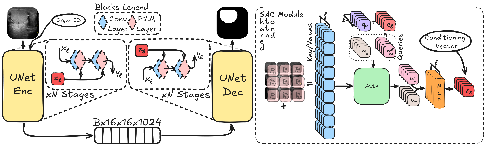

# US-FiLMUNet: Cross-Domain Ultrasound Segmentation

This repository contains the official PyTorch implementation for the paper: "TOO BIG TO FAIL? NOT QUITE: FILM-UNET BEATS FOUNDATION MODELS IN CROSS-DOMAIN ULTRASOUND SEGMENTATION", submitted, and under review, to the MICCAI 2026 Conference.

Here you will find the code to run our model in inference and to fine-tune it on your own ultrasound image dataset.

  
   
  <em>
    Overview of the proposed FiLM-UNet architecture.
  </em>

## Dataset

**TesticulUS** is a multi-institutional ultrasound segmentation dataset composed of **1,054 images** collected from **two clinical centers**, capturing variability in acquisition protocols and devices to support cross-domain evaluation.

Each image is paired with a **pixel-wise expert-annotated segmentation mask**. The dataset is designed for:

- Cross-domain generalization experiments  
- Fine-tuning and transfer learning  
- Robustness benchmarking  

**Summary**
- Images: 1,054  
- Institutions: 2  
- Modality: Ultrasound  
- Annotations: Expert pixel-wise masks  

## Inference with our Pre-trained Model

The inference with our pre Trained model will be made availble after review process via official huuggingface hub

Anyway for [here]() there are the official weights of our flagship model 
